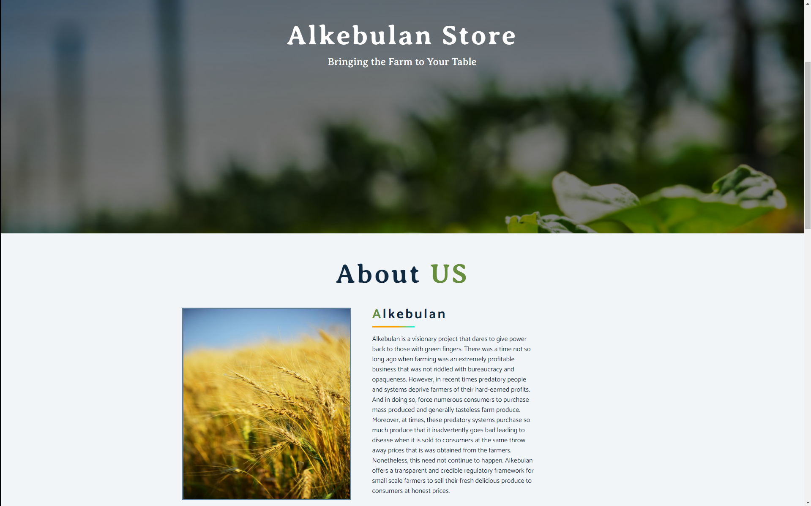
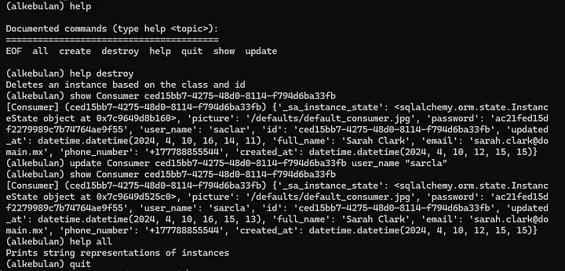
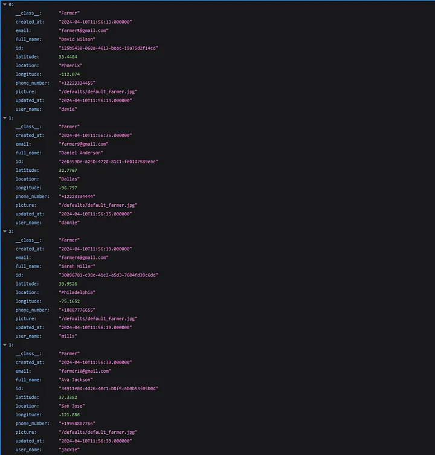
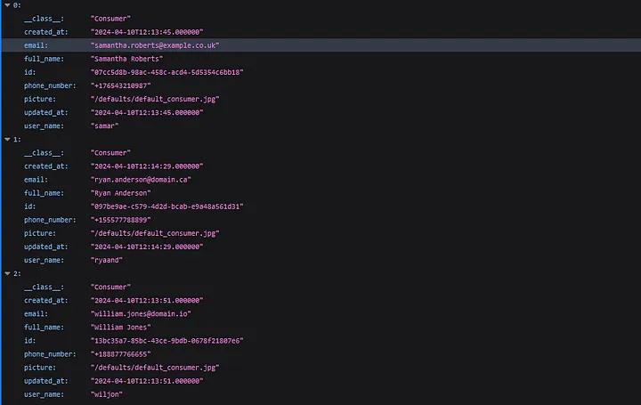
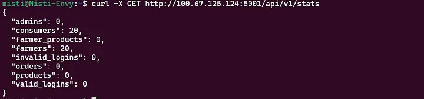
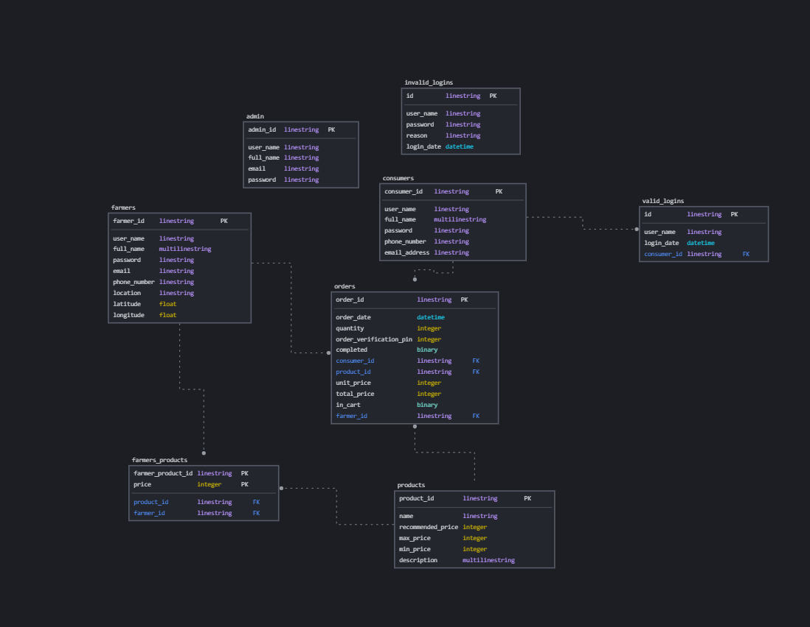

# Alkebulan
Bringing the Farm to your Doorstep



## Authors

### Misati Nyambane
He worked as the backend engineer for the project. He focused on building the database schema and API. Find him at the following platforms:

[GitHub](https://github.com/mistidevs)

[LinkedIn](https://www.linkedin.com/in/misati-nyambane/)

[Gmail](mailto:mistidevs@gmail.com)

### Omar Douiba


### Daniel Irom


## Live Demo
**The live demo detailing the Minimum Viable Product is currently experiencing technical difficulties.**

To access the API use this link:

[Alkebulan API](http://www.demistify.tech/alkebulan/api/)

## Introduction
Alkebulan is a visionary project that dares to give power back to those with green fingers. There was a time not so long ago when farming was an extremely profitable business that was not riddled with bureaucracy and opaqueness. However, in recent times predatory people and systems deprive farmers of their hard-earned profits. And in doing so, force numerous consumers to purchase mass produced and generally tasteless farm produce. Moreover, at times, these predatory systems purchase so much produce that it inadvertently goes bad leading to disease when it is sold to consumers at the same throw away prices that is was obtained from the farmers.

Nonetheless, this need not continue to happen. Alkebulan offers a transparent and credible regulatory framework for small scale farmers to sell their fresh delicious produce to consumers at honest prices.

### Our Motivation
Fundamentally, we all observed that small scale farmers in African countries are being exploited by middle men. A small scale farmer lacks direct access to consumers. Moreover, since they produce goods on a small scale they are unable to leverage any economies of scale. As a result, middle men- or even women- appear at their gates and offer to buy their goods at throw away prices. Primarily due to desperation, the farmers accept the meagre prices in order to recoup at least the money they spent on farm inputs.

This cycle of exploitation continues to be perpetuated season after season greatly demoralizing the farmers. Alkebulan steps into this niche and offers farmers the opportunity to get direct access to consumers at a small monthly fee. Moreover, the platform continuously regulates the prices of all goods sold on the platform. This bold move ensures that should middle men decide to use our platform they will be obliged to pay a fair price for all the goods they purchase.

Furthermore, we took a step back and realised that a good number of people are shifting towards organic and responsibly grown food sources. Alkebulan thus offers an efficacious solution to this by connecting consumers to farmers with fresh delicious produce. And thus our motto was born ‘Bringing the Farm to your Table’.

## Installation
> The installation instructions are written for Debian based Linux distributions. This is to oblige to the industry standards that most servers that host web services are Debian based Operating Systems.

### Setting Up MySQL Server
Start with fetching the latest versions from the PPA (Personal Package Archive). And also to play safe upgrade the system.

```{bash}
sudo apt update
sudo apt upgrade
```

Next run the following command to install MySQL Server:

```{bash}
sudo apt install mysql-server
```

Furthermore to integrate with Python install the needed libraries using the following commands:

```{bash}
sudo apt install python3-dev default-libmysqlclient-dev build-essential pkg-config
sudo pip install mysqlclient
```

Next, we need to create the database that we will use for the web application. Furthermore, a user dedicated specifically to this web application is invaluable. To effect this run the following command:

```{bash}
cat setup.sql | sudo mysql
```

This will pipe the contents of the file setup.sql to a mysql instance effectively creating a user and database. The file can be customised as needed.

### Installing Python Packages
The following command should install all the Python packages needed to run the web application:

```{bash}
pip install flask flask-cors flask-login flasgger sqlalchemy datetime uuid
```

## Usage
### The Console
The console can be used with a FileStorage engine or with a DBStorage engine. To start it with the file storage engine run the command as follows ensuring the current user has executable rights on the file:

```{bash}
python3 ./console.py
```

To run it with a database connection run it as follows:

```{bash}
ALKEBULAN_MYSQL_USER=alkebulan_dev ALKEBULAN_MYSQL_PWD=alkebulan_dev_pwd ALKEBULAN_MYSQL_HOST=localhost ALKEBULAN_MYSQL_DB=alkebulan_db ALKEBULAN_TYPE_STORAGE=db python3 ./console.py
```

This aligns with the configuration present in the setup.sql file. The image below shows the console in action.



### The API
It is recommended that the API is run only with the DBStorage option. This is because the API has been built for production rather than debugging and testing new features. The API is thus run using the following command:

```{bash}
ALKEBULAN_MYSQL_USER=alkebulan_dev ALKEBULAN_MYSQL_PWD=alkebulan_dev_pwd ALKEBULAN_MYSQL_HOST=localhost ALKEBULAN_MYSQL_DB=alkebulan_db ALKEBULAN_TYPE_STORAGE=db python3 -m api.v1.app
```

This will start the API on port 5001. However, another port can be specified using the `HBNB_API_PORT` environmental variable. Similarly, the host can be specified using the `HBNB_API_HOST` variable.

The pictures below show the routes `api/v1/farmers` and `api/v1/consumers` respectively:





The API can also be invoked from the terminal as follows:



## Backend
### A Brief Tangent
The backend is often an overlooked or frustrating part of a project. It feels really amazing when things ‘just’ work. However, when they are slow or even buggy it can be really annoying. Think about this, if YouTube/Facebook/Instagram/TikTok began to run even a few seconds slower at every click it would lead to a loss of user interest and people would honestly learn to touch grass more.

To iterate in another perspective. If a school’s e-learning platform became buggy and slow this would frustrate the aims of creating a seamless learning environment. In our perspective, having a blazing fast scalable product allows thousands or even millions of users to able to access fresh farm products in season. Farm produce easily goes bad and downtime of even half a day could lead to spoilage of farm produce on a huge magnitude. Thus, stability and efficiency is the cornerstone of this implementation.

### Database Schema
The database system I chose is MySQL and the ORM is SQLAlchemy. It took 10 iterations to reach upon my current database schema and I am still counting. The database has the following tables:

- Farmers: This table holds all the farmers that have set up store with Alkebulan.
- Consumers: This table holds all the people who trust Alkebulan to bring the farm to their doorstep.
- Orders: This table holds all the orders that have been made by consumers to farmers.
- Products: These are all the products that Alkebulan sells at any one point.
- Farmer Products: This is a table holding pairs of a farmer and the each and every product they sell.
- Valid Logins: These are all the logins that are valid.
- Invalid Logins: These are all the logins that are invalid
- Admins: This table holds all the administrators present in the database. They are able to monitor all other operations.

Furthermore, the schema is as below:



### Application Programming Interface
#### Methods
The methods below are when you are testing the API in a local environment. When using the API link detailed above the /v1/ is not needed.

##### GET
/api/v1/consumers  
/api/v1/consumers/<consumer_id>  
/api/v1/products  
/api/v1/products/<product_id>  
/api/v1/farmer_products  
/api/v1/farmer_products/<farmer_product_id>  
/api/v1/orders  
/api/v1/orders/<order_id>  
/api/v1/farmers  
/api/v1/farmers/<farmer_id>  
/api/v1/admins  
/api/v1/admins/<admin_id>  

##### DELETE
/api/v1/consumers/<consumer_id>  
/api/v1/products/<product_id>  
/api/v1/farmer_products/<farmer_product_id>  
/api/v1/orders/<order_id>  
/api/v1/farmers/<farmer_id>  

##### POST
/api/v1/consumers  
/api/v1/products  
/api/v1/farmer_products  
/api/v1/orders  
/api/v1/farmers  

##### PUT
/api/v1/consumers/<consumer_id>  
/api/v1/products/<product_id>  
/api/v1/farmer_products/<farmer_product_id>  
/api/v1/orders/<order_id>  
/api/v1/farmers/<farmer_id>  

### Console


## Frontend

### Flask Web Framework
The web framework implements multiple routes that encompass:

- Signing up as a consumer
- Logging in as a consumer
- Adding elements to a cart
- Viewing the full product catalogue
- Viewing a snippet of the products
- Logging out

As a Minimum Viable Product the integration is yet to have a user page, farmer pages and order tracking. These can be implemented in another iteration.
## Commit Framework
### Branch Commits
code (name of file) : (change made)  
test (name of file) : (test created)  
docs (name of file) : (documentation done)  
bug (name of file) : (bug introduced or discovered)  
frustration (name of file) : (error or complication present)

### Pull Requests Commits
feature (directories affected) : (feature added)  
fix (directories affected) : (bug resolved)

## Contributing
As this is a portfolio project with a minimum viable product implementation feel free to fork the code and play around with it. Think of this project as a proof of concept. It shows how to build a full stack e-commerce website.

The frontend has much to be desired without a doubt. Nonetheless, due to a solid and stable backend with extendable but not modifiable classes in the right hands this project can easily be really amazing. Realise that such a project requires to be in a localised area. The consumer goes to the farmer to get the goods or the farmer makes a delivery. This means that the consumer and farmer require to be in roughly the same locality.

## Related Projects
At the moment we know of one project that seeks to do the exact same thing as this project. This is GrownBy which serves some states in America with the exact same farmer to consumer offer.

## Licensing
MIT License with Attribution

Permission is hereby granted, free of charge, to any person obtaining a copy
of this software and associated documentation files (the "Software"), to deal
in the Software without restriction, including without limitation the rights
to use, copy, modify, merge, publish, distribute, sublicense, and/or sell
copies of the Software, and to permit persons to whom the Software is
furnished to do so, subject to the following conditions:

The above copyright notice and this permission notice shall be included in all
copies or substantial portions of the Software.

You must give appropriate credit, provide a link to the license, and indicate if changes were made. You may do so in any reasonable manner, but not in any way that suggests the licensor endorses you or your use.

THE SOFTWARE IS PROVIDED "AS IS", WITHOUT WARRANTY OF ANY KIND, EXPRESS OR
IMPLIED, INCLUDING BUT NOT LIMITED TO THE WARRANTIES OF MERCHANTABILITY,
FITNESS FOR A PARTICULAR PURPOSE AND NONINFRINGEMENT. IN NO EVENT SHALL THE
AUTHORS OR COPYRIGHT HOLDERS BE LIABLE FOR ANY CLAIM, DAMAGES OR OTHER
LIABILITY, WHETHER IN AN ACTION OF CONTRACT, TORT OR OTHERWISE, ARISING FROM,
OUT OF OR IN CONNECTION WITH THE SOFTWARE OR THE USE OR OTHER DEALINGS IN THE
SOFTWARE.
